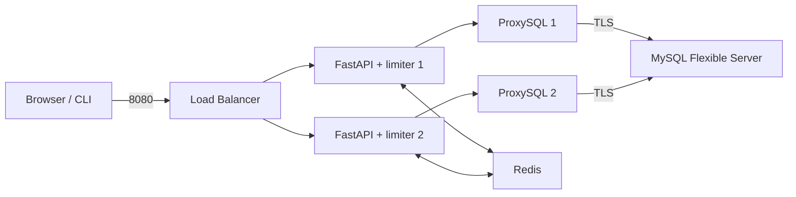

# Azure MySQL + ProxySQL 限流与高可用 Demo

使用 Python 3.12 / FastAPI 实现按预定义 SQL 的 QPS 和并发控制，通过双 ProxySQL 节点、共享 Redis 和 Web 控制台对比正常流量、限流、分布式配额及故障恢复。Azure 目标为 MySQL Flexible Server 私网实例；本地环境使用真实容器链路。



## 本地快速开始

前置条件：Python 3.12、Docker Engine 与 Compose（支持 `run --env-from-file`）、Make、OpenSSL。Azure 操作另需 Terraform、已登录的 Azure CLI 及目标订阅/RG 权限。

```bash
make install
make demo-local
# Open http://localhost:8080
make test-demo
```

没有 Docker socket 权限但已有 sudo 权限时，使用 `DOCKER='sudo -n docker' make demo-local`。命令只管理当前 Compose 项目，不修改系统 Docker 服务或用户组。

首次启动生成仅用于本地的随机密码 `.env`（权限 `600`），初始化 `customers`、`orders`、`query_audit`，配置两个 ProxySQL 的业务/monitor 用户、TLS 后端、路由和保护规则。再次启动复用既有本地数据；不要修改密码后假定已有 MySQL 数据卷会自动更换 root 密码。

HTTP `8080`、Redis 测试端口 `16379` 和直接 MySQL 入口 `16033` 只绑定 loopback。直接 MySQL 入口不经过 HTTP limiter，不提供严格 QPS/并发保证。应用到 ProxySQL 使用本地生成的证书并验证节点主机名；ProxySQL 到 MySQL 也使用 TLS 和独立 CA，业务/monitor 用户要求 SSL。本地 ProxySQL 演示证书有效期 30 天，不用于生产。

```bash
make stop-local                       # Stop containers; retain demo data
make clean-local                      # Remove this project's containers and data volume
```

`clean-local` 只用于明确可重建的本地 Demo 数据。`.env` 和 `artifacts/` 不提交 Git。

## 控制台和场景判读

页面显示 LB 入口、当前响应节点、两节点 ready 与 MySQL/ProxySQL/Redis 状态。选择模式和预置场景后启动；参数边界由服务端下发并在两端校验。结果支持取消、刷新恢复、SSE 重连/轮询回退及 JSON 下载。

| 场景 | 预期与判读 |
| --- | --- |
| 阈值内 QPS | 正常请求成功，无依赖错误 |
| 超过 QPS | 同时出现成功和 429，观察初始 burst 后的速率 |
| 阈值内并发 | 同时执行数不超过配置，正常完成 |
| 超过并发 | 排队，超时后出现 429；不能把 503 计为限流 |
| 双节点分布式 | 两节点都有处理量，但全局阈值不翻倍 |
| 节点故障转移 | 默认关闭 Web 故障注入；通过受控管理脚本执行并记录实际恢复 |

默认 QPS 为 `10`、burst 为 `5`；并发上限为 `3`、排队超时为 `500 ms`。token bucket 允许短时突发，不应把每秒成功数略超 10 直接判成失败。并发排队超时返回 `429`、`Retry-After`、`concurrency_limit_exceeded`；数据库/ProxySQL 不可用返回 `503`。

`local` 是每节点独立配额，双节点总量可能放大；`distributed` 使用 Redis 原子准入及带唯一 ID/TTL 的并发租约。取消、超时和数据库异常均需释放令牌。无论 limiter 模式为何，双节点运行元数据、事件、取消和最终摘要都共享 Redis，不依赖浏览器碰巧连回原节点。

CLI 和 Web 使用同一压测核心及带 `schema_version` 的结果 schema。图表按 1 秒桶显示请求、成功、429/503、并发、P50/P95/P99 和节点分布；验收看原始计数和服务端指标，而非只看截图。`/metrics` 使用 Prometheus 格式，标签不包含完整 SQL 或高基数用户 ID。

结果中的状态码 `0` 专门表示传输失败或取消导致没有 HTTP 响应，不伪装成服务器返回的 503。`summary.peak_concurrency` / 每秒 `concurrency` 是压测 HTTP 在途请求峰值；`peak_sql_concurrency` 是服务端响应采样的配额占用峰值，distributed 并发场景下才是全局 SQL 配额信号。

负载生成器按实际发送时间维持节奏，不在延迟后追赶补发；出现延迟或并发背压时，实际请求数可能低于 `QPS × 持续时间`，图表和 JSON 均使用实际计数。

## 测试与结果

```bash
source .venv/bin/activate
python -m pytest
make test                             # Uses this local demo's Redis when .env exists
ruff check .
ruff format --check .
make test-demo
bash scripts/test-qps-limit.sh
bash scripts/test-concurrency-limit.sh
bash scripts/test-distributed-limit.sh
python -m playwright install chromium
make test-web
DOCKER='sudo -n docker' bash scripts/failover-test.sh
DOCKER='sudo -n docker' bash scripts/collect-results.sh
```

单个测试使用实际 pytest node ID：`python -m pytest limiter/tests/test_web_smoke.py::test_console_success_rejection_and_restore`，此浏览器测试还需 `DEMO_BASE_URL=http://127.0.0.1:8080`。完整测试范围见 [测试计划](docs/test-plan.md)。

负载 JSON、ProxySQL stats、健康状态与指标保存在 `artifacts/`，不提交运行产物。故障测试持续通过统一入口发流量、停止 ProxySQL-1、验证 ProxySQL-2 承接，再恢复并确认节点重新 ready；测量短暂失败和恢复时间，不承诺零中断。

## Azure Terraform

基础设施按网络、私网数据库、计算、负载均衡和可选可观察性模块组织，仅维护 Terraform，不维护 Bicep。共享 `rg-dev2` 是 data source，不归本项目 state 管理。节点配置来源是版本化模板及幂等脚本，应用发布与基础设施分离。

```bash
make terraform-check
bash scripts/plan.sh
# Review the resource/SKU/cost/state/cleanup summary first.
bash scripts/deploy.sh
# Deployment requires the exact DEPLOY confirmation.
.venv/bin/python scripts/azure-verify.py
bash scripts/destroy.sh
```

执行前核验登录订阅与实施规格中的目标名称一致；不自动切换。真实订阅 ID 通过内存中的 `ARM_SUBSCRIPTION_ID` 传入，不写进配置示例。私有 MySQL、TCP `6033` 和 HTTP `8080` 使用独立探测，HTTP `/readyz` 同时检查应用和本机 ProxySQL 链路。默认不公开 HTTP；显式公开时必须限定 CIDR，页面可触发负载，不能暴露给不可信用户。

`azure-verify.py` 从后端池外的 Redis VM 执行两种模式的十个场景和真实 Chromium smoke，然后注入有自动恢复保护的 20 秒 ProxySQL 故障，核验存活节点与恢复后的流量。它通过受保护 Run Command 在私网内执行，不要求当前开发机建立 VNet peering，也不开放公网入口；原始结果、TLS/ProxySQL 统计和 LB 探测指标收回 `artifacts/azure/`。验证会临时使用浏览器容器，不应与其他手动压测同时运行。

Terraform/provider 版本及锁文件在 `infra/terraform/`；敏感输入使用环境变量或受限本地配置。默认本地 state；`sensitive=true` 不等于 state 已加密。state/plan 和真实 tfvars 均不提交，plan 检查后删除。远程 backend 配置及迁移见 [运维说明](docs/operations.md)。

**成本和权限：** MySQL、三个节点（两个应用/ProxySQL、一个 Redis）、磁盘、LB、出口网络/IP 均可能收费，MySQL HA 和可选监控会增加成本。部署前按实际 region/SKU/数量/预计时长核算；不得以 Demo 为由无限保留资源。VM 停机不代表磁盘/IP 零费用。未明确输入 `DEPLOY` 前，不创建收费资源。销毁只针对当前 state 且标记为本项目的精确资源，展示清单并确认完整项目标识，绝不删除共享资源组。

## 支持边界与可移植性

ProxySQL query rules 负责路由/重写/延迟/超时/拒绝，不提供本 Demo 的精确分布式 QPS/并发算法。连接池 `max_connections` 是资源保护，不等于某 SQL 指纹的执行中并发数。

ProxySQL Cluster 同步配置，不负责流量切换；本实现以 Git 模板同步节点，配置加载到 runtime 并保存到 disk。Azure LB 健康探测只影响新连接分配，已有 TCP 连接不保证自动迁移。Azure MySQL HA 与 ProxySQL HA 相互独立；单机 Redis 是演示成本取舍，仍是单点故障。

Azure 后端节点不能依赖回访自身 LB frontend 的 hairpin 行为。Azure 内嵌压测通过后端池之外 Redis VM 上的固定目标 relay 再访问内部 LB，仅允许预定义查询路径；浏览器入口仍是 Azure LB。本地 HAProxy 验证不能替代这一 Azure 网络边界的部署后验收。

ProxySQL 为开源组件，Azure MySQL 支持不自动覆盖其运维；生产环境需维护版本兼容、认证插件、TLS 信任、升级及故障处理。生产化还需身份认证、HTTPS 网关、Redis HA、持久任务调度、配额审计、备份和告警。参见 [安全说明](docs/security.md)。

应用镜像、配置契约和测试可复用；Azure VNet、委派子网、私有 DNS、LB、VM、托管数据库资源属于 Azure provider-specific 实现。第二云需新建对应 provider 模块并重新验证网络、身份、TLS、全局配额与故障转移，不能把 Terraform 视为自动跨云。完整矩阵与官方依据见 [架构说明](docs/architecture.md)。
