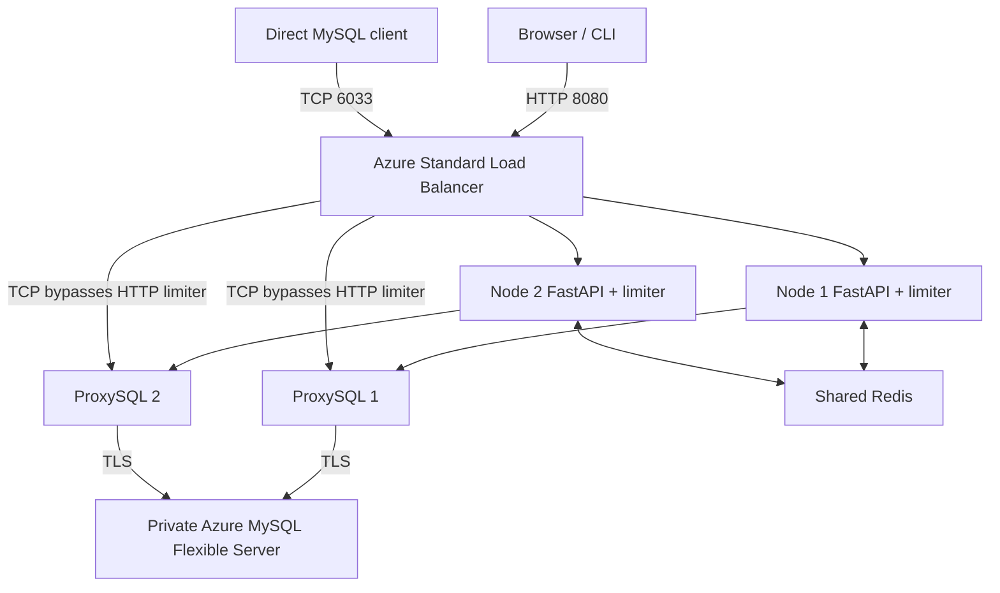

# 架构与机制边界

本地 Compose 用 HAProxy 模拟统一入口，后端为真实 MySQL、ProxySQL 和 Redis 容器。它验证应用链路，不替代 Azure Load Balancer 的真实故障转移验收。FastAPI 同时提供静态页面、API、SSE 和 Prometheus 指标，前端不访问 CDN。

## 三类机制

| 机制 | 实现位置 | 能保证什么 |
| --- | --- | --- |
| 严格 QPS / 执行中并发配额 | 自定义 Python + Redis 原子操作 | 对已定义 query_id 控制请求准入 |
| 连接池隔离 / 背压 | ProxySQL hostgroup / max_connections | 限制后端连接资源，不等于单 SQL 执行信号量 |
| SQL 路由 / 超时 / 拒绝 | ProxySQL mysql_query_rules | 匹配指定 SQL 并应用治理规则，不是分布式 token bucket |

QPS 允许初始 burst，因此短时间成功数可以超过 `rate × duration`，但不应超过 `burst + rate × duration` 的包络。并发超限先等待，超过 `queue_timeout_ms` 返回 `429`、`Retry-After` 和 `concurrency_limit_exceeded`。`503` 表示依赖故障，不能计作限流成功。

`local` 的配额每节点独立，负载分散时总阈值可能放大；`distributed` 两节点共享 Redis 全局配额。分布式并发租约含唯一 ID 和 TTL，查询有更短的硬超时，避免进程异常后永久占用。正常退出、超时和取消均释放令牌。

无论限流模式为何，双节点运行状态、取消、事件、最终摘要和 heartbeat 均共享于 Redis。SSE 按最后事件 ID 恢复；浏览器故障时回退轮询，不把丢失最终状态包装成完成。CLI 和 Web 调用同一服务端压测核心，JSON 结果共享 `schema_version=1`。

## 故障域

ProxySQL 模板是配置源；更新后执行 `LOAD ... TO RUNTIME` 和 `SAVE ... TO DISK`。本实现不依赖 ProxySQL Cluster；该特性同步配置，不迁移客户端连接。LB TCP probe 检查 `6033`，HTTP probe 检查 `/readyz`，只有应用与本机 ProxySQL 后端链路可用才接收新 HTTP 流量。

Azure probe 控制新连接去向，不保证现有 TCP 流迁移。压测采用独立连接并记录真实短暂错误和恢复时间，不声称零中断。数据库 HA 是另一故障域，启用会增加成本；单机 Redis 是演示成本取舍，存在单点故障，故障时应显式拒绝服务而非悄悄退回本地计数。

Azure 还有一个本地 HAProxy 无法模拟的边界：LB 后端 VM 回访自身服务的 frontend VIP（hairpin）不受支持。因此 Azure 内嵌压测需经不在 LB 后端池中的 Redis VM 上的固定目标 HTTP relay，再进入内部 LB；relay 只允许 `POST /query`，目标由 Terraform 内部 LB 输出生成，不接受用户指定地址。它不替代限流、不做流量故障切换，也不引入第三套业务节点。Redis VM 故障将同时影响分布式配额和演示负载入口。

## 可移植性

| 层 | 可复用范围 | 第二云所需变更 |
| --- | --- | --- |
| Python 限流/API、静态页面、结果 schema | 应用镜像与代码直接复用 | 注入相同环境变量 |
| ProxySQL 模板、SQL、测试场景 | 逻辑可复用 | 数据库 CA、版本及端点兼容验证 |
| Terraform 工作流 | init/plan/apply/destroy 方法可复用 | 独立 provider 模块 |
| VNet、委派子网、私有 DNS、LB、VM、托管 MySQL | Azure 专用 | 重写目标云网络/身份/资源映射 |
| State backend | Terraform 支持不同后端 | 配置认证及 backend 块，执行迁移 |

第二云最小验证路径：实现网络/数据库/两节点/LB/Redis 模块，将端点映射到 `DATABASE_*`、`REDIS_*`、`LIMITER_*`，复用镜像运行全部场景及真实节点故障测试，验证 TLS、全局阈值和结果 schema。Terraform 不会让 Azure 资源定义自动变成多云资源。

## 官方依据

以下文档于 2026-09-09 通过公开检索/提取核验；实际区域和 SKU 能力以部署前 Azure 只读查询为准。

- [Azure MySQL 私网与委派子网](https://learn.microsoft.com/en-us/azure/mysql/flexible-server/concepts-networking-vnet)
- [Azure MySQL TLS 配置](https://learn.microsoft.com/en-us/azure/mysql/security/security-tls-how-to-connect)
- [Azure Load Balancer 健康探测及现有连接行为](https://learn.microsoft.com/en-us/azure/load-balancer/load-balancer-custom-probe-overview)
- [Azure Load Balancer 平台限制，包括 hairpin](https://learn.microsoft.com/en-us/troubleshoot/azure/load-balancer/troubleshoot-load-balancer-platform-limitations)
- [ProxySQL query rewrite / query rules](https://www.proxysql.com/documentation/query-rewrite/)
- [ProxySQL 多层配置和 LOAD/SAVE](https://www.proxysql.com/documentation/main-runtime/multi-layer-configuration)
- [ProxySQL Cluster 配置同步](https://proxysql.com/documentation/proxysql-cluster/)
